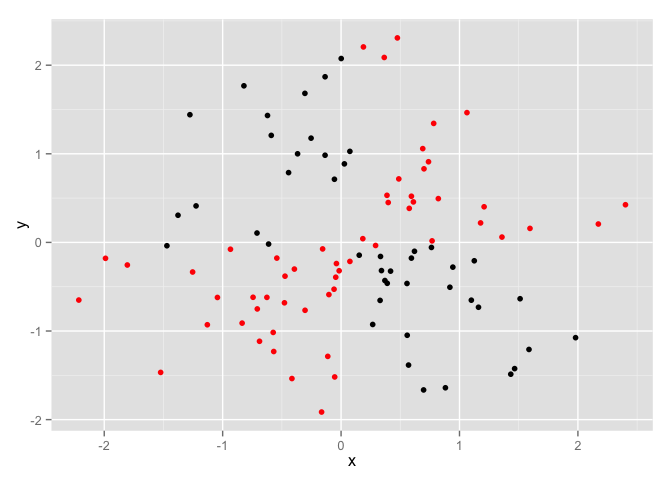
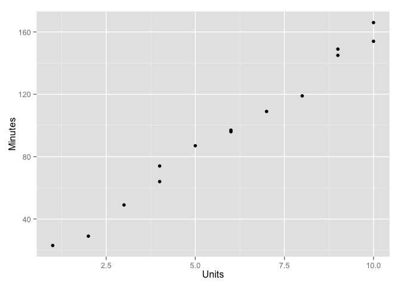
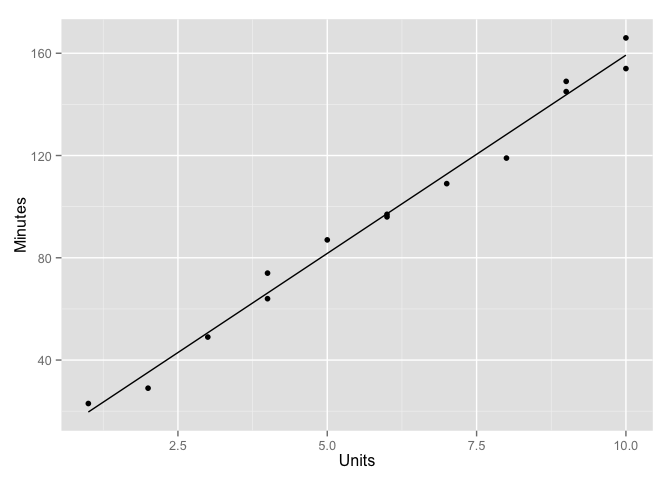
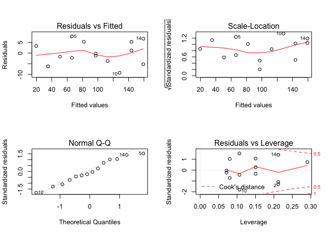
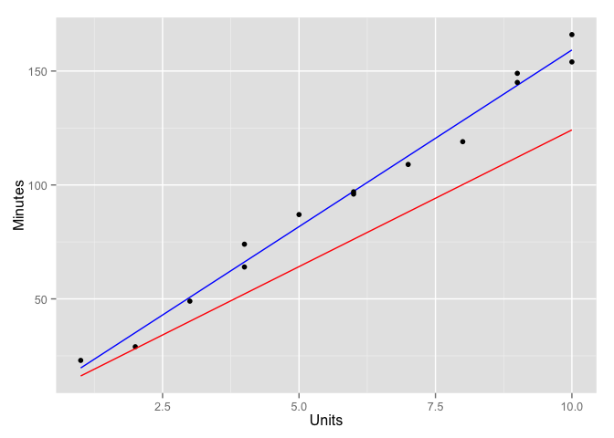
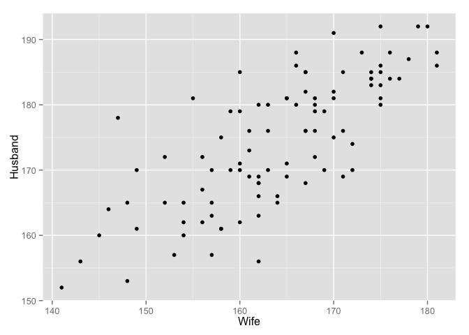
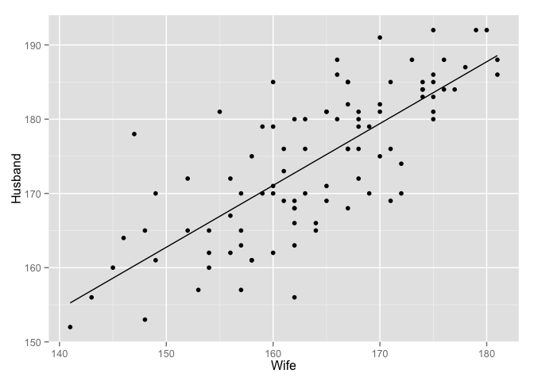
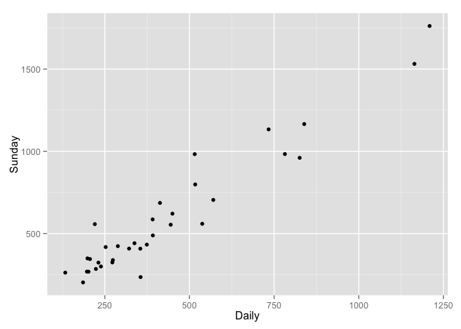
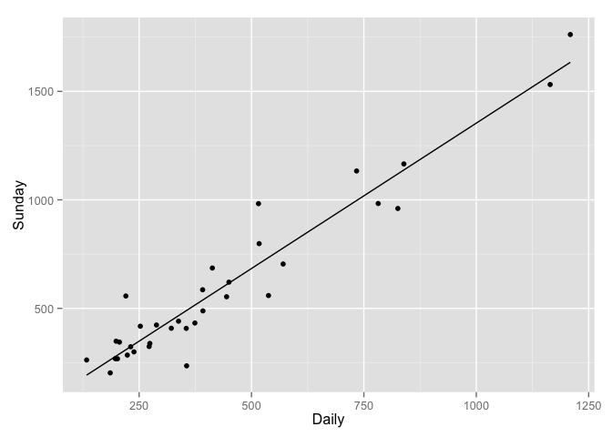

# Chapter 02

# Data

```r
set.seed(1)
n = 100
D = data.frame(
  x = rnorm(n),
  y = rnorm(n)
)
```

# 2.1 Covariance

Deviation from Mean and Product of Deviations from the Mean:


```r
D$devp = (D$x-mean(D$x)) * (D$y-mean(D$y))
sum(D$devp)/(n-1)
```

```
## [1] -0.0008554794
```

```r
cov(D$x, D$y)
```

```
## [1] -0.0008554794
```

Covariance is the sum of the product of x and y's deviation from the mean divided by n-1.


```r
D$devp.col = ifelse(D$devp<=0, "black", "red")
ggplot(D, aes(x,y)) +
  geom_point(color=D$devp.col)
```

 

Sign of the product of the deviation of the mean roughly equal to the *direction* of the linear relationship but nothing about the *strength* of that relationship.

# 2.2 Correlation Coefficient

Standardize both X and Y:


```r
D$zx = (D$x-mean(D$x))/sd(D$x)
D$zy = (D$y-mean(D$y))/sd(D$y)
(sum(D$zx*D$zy))/(n-1)
```

```
## [1] -0.0009943199
```

```r
cor(D$x, D$y)
```

```
## [1] -0.0009943199
```

Measures both the *direction* and *strength* of the linear relationship between variables.

# 2.4 Simple Linear Regression

> How do you know, in advance, if the relationship between X and Y is indeed
> ameanable to modeling with a linear equation?

Addressed on page 32: Visual inspection with scatter plots with least squares regression line plotted.

# 2.5 Parameter Estimation


```r
COMPUTER = read.csv("./All_Data//P031.txt", sep="\t")
p=ggplot(COMPUTER, aes(Units, Minutes)) +
  geom_point()
print(p)
```

 

```r
# Calc coefficients for the least squares regression line
hat_B_1 = sum( (COMPUTER$Minutes-mean(COMPUTER$Minutes))*(COMPUTER$Units - mean(COMPUTER$Units)) ) / sum( (COMPUTER$Units-mean(COMPUTER$Units))^2 )
hat_B_0 = mean(COMPUTER$Minutes) - hat_B_1*mean(COMPUTER$Units)

# Compute line
LSR = data.frame(hat_X = COMPUTER$Units)
LSR$hat_Y = hat_B_0 + hat_B_1*LSR$hat_X
p = p + geom_line(data=LSR, aes(hat_X, hat_Y))
print(LSR)
```

```
##    hat_X     hat_Y
## 1      1  19.67043
## 2      2  35.17920
## 3      3  50.68797
## 4      4  66.19674
## 5      4  66.19674
## 6      5  81.70551
## 7      6  97.21429
## 8      6  97.21429
## 9      7 112.72306
## 10     8 128.23183
## 11     9 143.74060
## 12     9 143.74060
## 13    10 159.24937
## 14    10 159.24937
```

```r
print(p)
```

 

With R's `lm()` function:

```r
COMPUTER.lm = lm(Minutes ~ Units, COMPUTER)
layout(matrix(1:4,2,2))
plot(COMPUTER.lm)
```

 

Explanation of plots from [Using R for Linear Regression](http://www.montefiore.ulg.ac.be/~kvansteen/GBIO0009-1/ac20092010/Class8/Using%20R%20for%20linear%20regression.pdf):

> The plot in the upper left shows the residual errors plotted versus their fitted values. The residuals should be randomly distributed around the horizontal line representing a residual error of zero; that is, there should not be a distinct trend in the distribution of points. The plot in the lower left is a standard Q-Q plot, which should suggest that the residual errors are normally distributed. The scale-location plot in the upper right shows the square root of the standardized residuals (sort of a square root of relative error) as a function of the fitted values. Again, there should be no obvious trend in this plot. Finally, the plot in the lower right shows each points leverage, which is a measure of its importance in determining the regression result. Superimposed on the plot are contour lines for the Cook’s distance, which is another measure of the importance of each observation to the regression. Smaller distances means that removing the observation has little affect on the regression results. Distances larger than 1 are suspicious and suggest the presence of a possible outlier or a poor model.


```r
ggplot(COMPUTER, aes(Units, Minutes)) +
  geom_point() +
  geom_line(data=fortify(COMPUTER.lm), aes(Units, .fitted))
```

 

# 2.6 Test of Hypothesis

How do we know if X is actually a useful predictor of Y?

* In $y_i=\beta_0 + \beta_1*X_i + \varepsilon_i$ we would know that $X$ and $Y$ do not have a linear relation  if $\beta_1=0$.
* If the above is true then for each X the resulting $\varepsilon_i$ will be independent, random, with a mean of zero, and an unknown common variance $\sigma^2$.

_long explanation..._

* degrees of freedom: Number of observations minus the number of estimated coefficients in the linear regression.

Statement of hypothesis:

* $H_0: \beta_1=0$ _meaning_ X and Y do not have a linear relation
* $H_1: \beta_1\not=0$ _meaning_ X and Y have some linear relation

Test with Student's t test. Only accept the null hypothesis ($H_0$) if:

$|t_1| \ge t_{(n-2,\alpha/2)}$

Calculated value of t-test is greater than or equal to the value from the table for a 2-degrees of freedom, two-sided test with a significance level of $\alpha$.

Alternate expression of the criteria:

$p|t_1| \le \alpha$

ie. the _p-value_ is less than the significance level.

## t-test with Computer Example Data

Dilbert's boss estimates that each additional component adds 12 minutes to the repair time. Does the data support this intuition?

* $H_0$: _Yes_ which implies $\beta_1 = 12$
* $H_1$: _No_ which implies $\beta_1 \ne 12$

Spreadsheet Bob would estimate off the data: $\overline{(\frac{minutes}{units})}$ = 16.6437925. I'd be inclined to agree since there is no instance of a repair in the data where minutes-per-unit was less than 12. But look at the minutes added per each additional unit, on average:


```r
COMPUTER %>%
  group_by(Units) %>%
  summarise(MeanMinutes=mean(Minutes), MinPerUnit=sum(Minutes)/sum(Units)) %>%
  mutate(DeltaMeanMinutes=MeanMinutes-lag(MeanMinutes))
```

```
## Source: local data frame [10 x 4]
## 
##    Units MeanMinutes MinPerUnit DeltaMeanMinutes
## 1      1        23.0   23.00000               NA
## 2      2        29.0   14.50000              6.0
## 3      3        49.0   16.33333             20.0
## 4      4        69.0   17.25000             20.0
## 5      5        87.0   17.40000             18.0
## 6      6        96.5   16.08333              9.5
## 7      7       109.0   15.57143             12.5
## 8      8       119.0   14.87500             10.0
## 9      9       147.0   16.33333             28.0
## 10    10       160.0   16.00000             13.0
```

Eh... maybe the boss was correct? 5 cases where the delta is near 12, 4 where it isn't close.

Use the t-test:

* $\hat\sigma^2$ = Calc sum-of-the-square-errors (SSE) divided by the degrees of freedom:


```r
hat_sigma2 = sum( (COMPUTER$Minutes - LSR$hat_Y)^2 ) / (nrow(COMPUTER)-2)
se_hat_beta1 = sqrt(hat_sigma2)/sqrt(sum( (COMPUTER$Units-mean(COMPUTER$Units))^2 ))
```

Therefore:

$t_1 = \frac{\hat\beta_1-12}{s.e.(\hat\beta_1)} = \frac{15.5087719-12}{0.5049813} = 6.9483204$

Here the book references an unknown table of t-test results that claims $t_{(n-2,\alpha/2)}=t_{12,0.25)}=2.18$ and that since $t_1 = 6.9483204 \gt 2.18$ that the null hypothesis must be rejected and $\beta_1 \ne 12$.

### ala R


```r
COMPUTER_EST = rbind( 
  # Actual observations
  mutate(COMPUTER, dataset="observed"),

  # Management prediction
  COMPUTER %>%
    mutate(
      dataset = "management",
      Minutes = Units*12 + hat_B_0
    )
)
print(COMPUTER_EST)
```

```
##      Minutes Units    dataset
## 1   23.00000     1   observed
## 2   29.00000     2   observed
## 3   49.00000     3   observed
## 4   64.00000     4   observed
## 5   74.00000     4   observed
## 6   87.00000     5   observed
## 7   96.00000     6   observed
## 8   97.00000     6   observed
## 9  109.00000     7   observed
## 10 119.00000     8   observed
## 11 149.00000     9   observed
## 12 145.00000     9   observed
## 13 154.00000    10   observed
## 14 166.00000    10   observed
## 15  16.16165     1 management
## 16  28.16165     2 management
## 17  40.16165     3 management
## 18  52.16165     4 management
## 19  52.16165     4 management
## 20  64.16165     5 management
## 21  76.16165     6 management
## 22  76.16165     6 management
## 23  88.16165     7 management
## 24 100.16165     8 management
## 25 112.16165     9 management
## 26 112.16165     9 management
## 27 124.16165    10 management
## 28 124.16165    10 management
```

```r
ggplot() +
  geom_line(data=fortify(COMPUTER.lm), aes(Units, .fitted), color="blue") +
  geom_point(data=COMPUTER_EST[COMPUTER_EST$dataset=="observed",], aes(Units, Minutes)) +
  geom_line(data=COMPUTER_EST[COMPUTER_EST$dataset=="management",], aes(Units, Minutes), color="red") +
  ylab("Minutes")
```

 

```r
mgmt.ttest = t.test(Minutes ~ dataset, data=COMPUTER_EST, paired=TRUE)
print(mgmt.ttest)
```

```
## 
## 	Paired t-test
## 
## data:  Minutes by dataset
## t = -6.7847, df = 13, p-value = 1.292e-05
## alternative hypothesis: true difference in means is not equal to 0
## 95 percent confidence interval:
##  -27.75616 -14.34910
## sample estimates:
## mean of the differences 
##               -21.05263
```

* Per `?t.test` and [Student's t-Test](http://en.wikipedia.org/wiki/Student%27s_t-test) it seems appropriate to treat observed data and the management claim as a paired set of samples Therefore `paired=TRUE` is appropriate.

> Huh... not clear if I'm doing this right.

## Test Using Correlation Coefficient

$t_1 = \frac{Cor(Y,X)\sqrt{n-2}}{\sqrt{1-(Cor(Y,X))^2}}$


```r
(cor(COMPUTER$Minutes, COMPUTER$Units)*sqrt(nrow(COMPUTER-2))) / (sqrt(1-cor(COMPUTER$Minutes, COMPUTER$Units)^2))
```

```
## [1] 33.17229
```

Not the same as $t_1=6.9483204$ above. Not following.

# 2.8 Predictions


```r
predict(COMPUTER.lm, data.frame(Units=4))
```

```
##        1 
## 66.19674
```

# 2.9 Measuring Quality of Fit


```r
print(summary(COMPUTER.lm))
```

```
## 
## Call:
## lm(formula = Minutes ~ Units, data = COMPUTER)
## 
## Residuals:
##     Min      1Q  Median      3Q     Max 
## -9.2318 -3.3415 -0.7143  4.7769  7.8033 
## 
## Coefficients:
##             Estimate Std. Error t value Pr(>|t|)    
## (Intercept)    4.162      3.355    1.24    0.239    
## Units         15.509      0.505   30.71 8.92e-13 ***
## ---
## Signif. codes:  0 '***' 0.001 '**' 0.01 '*' 0.05 '.' 0.1 ' ' 1
## 
## Residual standard error: 5.392 on 12 degrees of freedom
## Multiple R-squared:  0.9874,	Adjusted R-squared:  0.9864 
## F-statistic: 943.2 on 1 and 12 DF,  p-value: 8.916e-13
```

Evidence of a good fit for this simple model:

* t-Value for the predictor Units (aka. $\hat\beta_1$) is large. (relative to what, exactly?)
* The two-sided p-value is very small. [Using R for Linear Regression](http://www.montefiore.ulg.ac.be/~kvansteen/GBIO0009-1/ac20092010/Class8/Using%20R%20for%20linear%20regression.pdf) has a good explanation of what the _Pr(>|t|) value means:

> Estimates for the model’s coefficients are provided along with the their (sic) standard deviations (‘Std Error’), and a t-value and probability for a null hypothesis that the coefficients have values of zero.

* $R^2$ is close to 1 indicating that almost all of the variance in the response variable is explained by the model.

# Homework

## 2.10 - Husbands and Wives


```r
HW=read.table("All_Data//P052.txt", sep="\t", header=TRUE)
p=ggplot(HW, aes(Wife, Husband)) + geom_point()
print(p)
```

 

```r
# a - cov of husbands and wives. Positive covariance.
cov(HW$Husband, HW$Wife)
```

```
## [1] 69.41294
```

```r
# b - cov in inches
cov(HW$Husband/2.54, HW$Wife/2.54)
```

```
## [1] 10.75903
```

```r
# c - cor of husbands and wives
cor(HW$Husband, HW$Wife)
```

```
## [1] 0.7633864
```

```r
# d - cor in inches
cor(HW$Husband/2.54, HW$Wife/2.54)
```

```
## [1] 0.7633864
```

```r
# e - cor if every man married a woman 5cm shorter == 1
cor(HW$Husband, HW$Husband-5)
```

```
## [1] 1
```

```r
# f - The response variable could be either the husband's or wife's height.
# Lets go with the Husband's height as the respose variable
# g - Test f with H0: slope == 0
HW.lm = lm(Husband ~ Wife, HW)
print(p + geom_line(data=fortify(HW.lm), aes(Wife, .fitted)))
```

 

```r
HW.lm.summary = summary(HW.lm)
print(HW.lm.summary)
```

```
## 
## Call:
## lm(formula = Husband ~ Wife, data = HW)
## 
## Residuals:
##      Min       1Q   Median       3Q      Max 
## -16.7438  -4.2838  -0.1615   4.2562  17.7500 
## 
## Coefficients:
##             Estimate Std. Error t value Pr(>|t|)    
## (Intercept) 37.81005   11.93231   3.169  0.00207 ** 
## Wife         0.83292    0.07269  11.458  < 2e-16 ***
## ---
## Signif. codes:  0 '***' 0.001 '**' 0.01 '*' 0.05 '.' 0.1 ' ' 1
## 
## Residual standard error: 6.468 on 94 degrees of freedom
## Multiple R-squared:  0.5828,	Adjusted R-squared:  0.5783 
## F-statistic: 131.3 on 1 and 94 DF,  p-value: < 2.2e-16
```

## 2.12 - Newspapers


```r
NEWS = read.csv("All_Data//P054.txt", sep="\t", header=TRUE)

# a - scatter plot
p = ggplot(NEWS, aes(Daily, Sunday)) + geom_point()
print(p)
```

 

```r
# b - fit
NEWS.lm = lm(Sunday ~ Daily, NEWS)
print(summary(NEWS.lm))
```

```
## 
## Call:
## lm(formula = Sunday ~ Daily, data = NEWS)
## 
## Residuals:
##     Min      1Q  Median      3Q     Max 
## -255.19  -55.57  -20.89   62.73  278.17 
## 
## Coefficients:
##             Estimate Std. Error t value Pr(>|t|)    
## (Intercept) 13.83563   35.80401   0.386    0.702    
## Daily        1.33971    0.07075  18.935   <2e-16 ***
## ---
## Signif. codes:  0 '***' 0.001 '**' 0.01 '*' 0.05 '.' 0.1 ' ' 1
## 
## Residual standard error: 109.4 on 32 degrees of freedom
## Multiple R-squared:  0.9181,	Adjusted R-squared:  0.9155 
## F-statistic: 358.5 on 1 and 32 DF,  p-value: < 2.2e-16
```

```r
print(p + geom_line(data=fortify(NEWS.lm), aes(Daily, .fitted)))
```

 

```r
# c - Confidence Interval
confint(NEWS.lm) # Estimate +/- Std. Error * t-value
```

```
##                  2.5 %    97.5 %
## (Intercept) -59.094743 86.766003
## Daily         1.195594  1.483836
```

```r
# d - Is there a significant relationship between Daily and Sunday circulation?
# Yes?

# e - 95% confidence interval for Daily with circulation=500,000
predict(NEWS.lm, data.frame(Daily=500000), interval="confidence", level=.95)
```

```
##        fit      lwr      upr
## 1 669871.2 597872.8 741869.7
```

```r
# g - how is this different?

# h - 95% confidence interval for Daily with circulation=2e6
predict(NEWS.lm, data.frame(Daily=2e6), interval="confidence", level=.95)
```

```
##       fit     lwr     upr
## 1 2679443 2391263 2967623
```

```r
# Not likely to be accurate. Outside of the bounds of training data.
```
