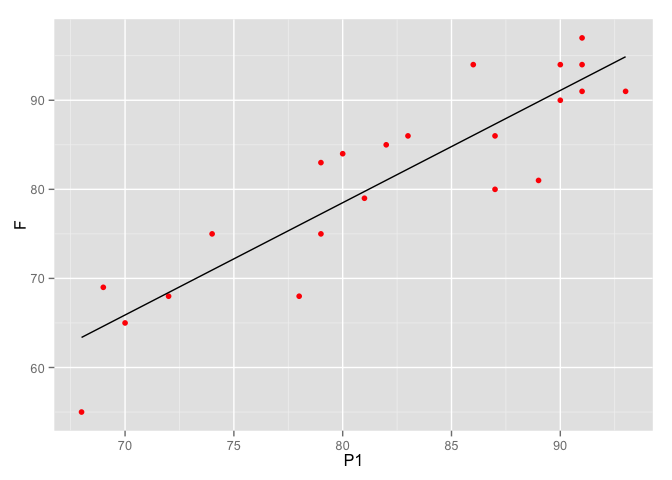
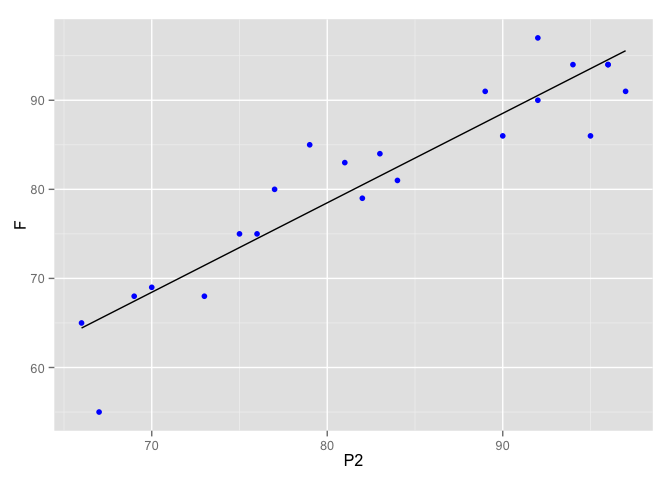

# Chapter 03


# 3.4 Multiple Linear Regression Parameter Estimation


```r
SUP = read.table("All_Data//P060.txt", sep="\t", header=TRUE)
SUP.lm = lm(Y ~ X1+X2+X3+X4+X5+X6, SUP)
print(summary(SUP.lm))
```

```
## 
## Call:
## lm(formula = Y ~ X1 + X2 + X3 + X4 + X5 + X6, data = SUP)
## 
## Residuals:
##      Min       1Q   Median       3Q      Max 
## -10.9418  -4.3555   0.3158   5.5425  11.5990 
## 
## Coefficients:
##             Estimate Std. Error t value Pr(>|t|)    
## (Intercept) 10.78708   11.58926   0.931 0.361634    
## X1           0.61319    0.16098   3.809 0.000903 ***
## X2          -0.07305    0.13572  -0.538 0.595594    
## X3           0.32033    0.16852   1.901 0.069925 .  
## X4           0.08173    0.22148   0.369 0.715480    
## X5           0.03838    0.14700   0.261 0.796334    
## X6          -0.21706    0.17821  -1.218 0.235577    
## ---
## Signif. codes:  0 '***' 0.001 '**' 0.01 '*' 0.05 '.' 0.1 ' ' 1
## 
## Residual standard error: 7.068 on 23 degrees of freedom
## Multiple R-squared:  0.7326,	Adjusted R-squared:  0.6628 
## F-statistic:  10.5 on 6 and 23 DF,  p-value: 1.24e-05
```

# Exercises

## 3.3 Exam Data


```r
EXAM = read.table("All_Data/P083.txt", sep="\t", header=TRUE)
E.lm1 = lm(F ~ P1, EXAM)
print(summary(E.lm1))
```

```
## 
## Call:
## lm(formula = F ~ P1, data = EXAM)
## 
## Residuals:
##    Min     1Q Median     3Q    Max 
## -8.844 -2.020 -0.587  4.043  7.938 
## 
## Coefficients:
##             Estimate Std. Error t value Pr(>|t|)    
## (Intercept) -22.3424    11.5640  -1.932   0.0676 .  
## P1            1.2605     0.1399   9.008 1.78e-08 ***
## ---
## Signif. codes:  0 '***' 0.001 '**' 0.01 '*' 0.05 '.' 0.1 ' ' 1
## 
## Residual standard error: 5.081 on 20 degrees of freedom
## Multiple R-squared:  0.8023,	Adjusted R-squared:  0.7924 
## F-statistic: 81.14 on 1 and 20 DF,  p-value: 1.779e-08
```

```r
print(anova(E.lm1))
```

```
## Analysis of Variance Table
## 
## Response: F
##           Df  Sum Sq Mean Sq F value    Pr(>F)    
## P1         1 2094.75 2094.75  81.138 1.779e-08 ***
## Residuals 20  516.34   25.82                      
## ---
## Signif. codes:  0 '***' 0.001 '**' 0.01 '*' 0.05 '.' 0.1 ' ' 1
```

```r
E.lm2 = lm(F ~ P2, EXAM)
print(summary(E.lm2))
```

```
## 
## Call:
## lm(formula = F ~ P2, data = EXAM)
## 
## Residuals:
##      Min       1Q   Median       3Q      Max 
## -10.4323  -1.5027   0.5421   2.2580   7.5165 
## 
## Coefficients:
##             Estimate Std. Error t value Pr(>|t|)    
## (Intercept) -1.85355    7.56181  -0.245    0.809    
## P2           1.00427    0.09059  11.086 5.44e-10 ***
## ---
## Signif. codes:  0 '***' 0.001 '**' 0.01 '*' 0.05 '.' 0.1 ' ' 1
## 
## Residual standard error: 4.275 on 20 degrees of freedom
## Multiple R-squared:   0.86,	Adjusted R-squared:  0.853 
## F-statistic: 122.9 on 1 and 20 DF,  p-value: 5.442e-10
```

```r
print(anova(E.lm2))
```

```
## Analysis of Variance Table
## 
## Response: F
##           Df  Sum Sq Mean Sq F value    Pr(>F)    
## P2         1 2245.63 2245.63  122.89 5.442e-10 ***
## Residuals 20  365.46   18.27                      
## ---
## Signif. codes:  0 '***' 0.001 '**' 0.01 '*' 0.05 '.' 0.1 ' ' 1
```

```r
E.lm3 = lm(F ~ P1 + P2, EXAM)
print(summary(E.lm3))
```

```
## 
## Call:
## lm(formula = F ~ P1 + P2, data = EXAM)
## 
## Residuals:
##     Min      1Q  Median      3Q     Max 
## -8.7328 -2.1703  0.3938  2.6443  6.3660 
## 
## Coefficients:
##             Estimate Std. Error t value Pr(>|t|)   
## (Intercept) -14.5005     9.2356  -1.570  0.13290   
## P1            0.4883     0.2330   2.096  0.04971 * 
## P2            0.6720     0.1793   3.748  0.00136 **
## ---
## Signif. codes:  0 '***' 0.001 '**' 0.01 '*' 0.05 '.' 0.1 ' ' 1
## 
## Residual standard error: 3.953 on 19 degrees of freedom
## Multiple R-squared:  0.8863,	Adjusted R-squared:  0.8744 
## F-statistic: 74.07 on 2 and 19 DF,  p-value: 1.069e-09
```

```r
print(anova(E.lm3))
```

```
## Analysis of Variance Table
## 
## Response: F
##           Df  Sum Sq Mean Sq F value    Pr(>F)    
## P1         1 2094.75 2094.75 134.084 4.721e-10 ***
## P2         1  219.51  219.51  14.051  0.001361 ** 
## Residuals 19  296.83   15.62                      
## ---
## Signif. codes:  0 '***' 0.001 '**' 0.01 '*' 0.05 '.' 0.1 ' ' 1
```

```r
ggplot(fortify(E.lm1)) + 
  geom_point(aes(P1, F), color="red") +
  geom_line(aes(P1, .fitted))
```

 

```r
ggplot(fortify(E.lm2)) + 
  geom_point(aes(P2, F), color="blue") +
  geom_line(aes(P2, .fitted))
```

 

