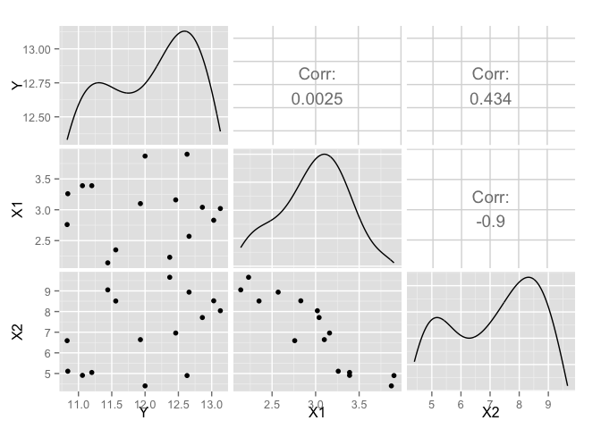

# Chapter 4

# 4.5.2 Hamilton's Data


```r
HAM = read.table("All_Data//P103.txt", sep="\t", header=TRUE)
HAM.lm1 = lm(Y ~ X1, HAM)
print(summary(HAM.lm1))
```

```
## 
## Call:
## lm(formula = Y ~ X1, data = HAM)
## 
## Residuals:
##      Min       1Q   Median       3Q      Max 
## -1.16910 -0.67912 -0.00326  0.64412  1.12993 
## 
## Coefficients:
##              Estimate Std. Error t value Pr(>|t|)    
## (Intercept) 11.988755   1.266891   9.463  3.4e-07 ***
## X1           0.003747   0.416083   0.009    0.993    
## ---
## Signif. codes:  0 '***' 0.001 '**' 0.01 '*' 0.05 '.' 0.1 ' ' 1
## 
## Residual standard error: 0.8324 on 13 degrees of freedom
## Multiple R-squared:  6.24e-06,	Adjusted R-squared:  -0.07692 
## F-statistic: 8.112e-05 on 1 and 13 DF,  p-value: 0.993
```

```r
HAM.lm2 = lm(Y ~ X2, HAM)
print(summary(HAM.lm2))
```

```
## 
## Call:
## lm(formula = Y ~ X2, data = HAM)
## 
## Residuals:
##      Min       1Q   Median       3Q      Max 
## -1.08999 -0.63345  0.00023  0.61458  1.04033 
## 
## Coefficients:
##             Estimate Std. Error t value Pr(>|t|)    
## (Intercept)  10.6319     0.8109  13.111 7.18e-09 ***
## X2            0.1955     0.1125   1.737    0.106    
## ---
## Signif. codes:  0 '***' 0.001 '**' 0.01 '*' 0.05 '.' 0.1 ' ' 1
## 
## Residual standard error: 0.7499 on 13 degrees of freedom
## Multiple R-squared:  0.1884,	Adjusted R-squared:  0.126 
## F-statistic: 3.018 on 1 and 13 DF,  p-value: 0.106
```

```r
HAM.lm3 = lm(Y ~ X1 + X2, HAM)
print(summary(HAM.lm3))
```

```
## 
## Call:
## lm(formula = Y ~ X1 + X2, data = HAM)
## 
## Residuals:
##       Min        1Q    Median        3Q       Max 
## -0.013632 -0.009451 -0.002279  0.008630  0.016325 
## 
## Coefficients:
##              Estimate Std. Error t value Pr(>|t|)    
## (Intercept) -4.515414   0.061142  -73.85   <2e-16 ***
## X1           3.097008   0.012274  252.31   <2e-16 ***
## X2           1.031859   0.003684  280.08   <2e-16 ***
## ---
## Signif. codes:  0 '***' 0.001 '**' 0.01 '*' 0.05 '.' 0.1 ' ' 1
## 
## Residual standard error: 0.01072 on 12 degrees of freedom
## Multiple R-squared:  0.9998,	Adjusted R-squared:  0.9998 
## F-statistic: 3.922e+04 on 2 and 12 DF,  p-value: < 2.2e-16
```


```r
library(GGally)
ggpairs(HAM)
```

 
